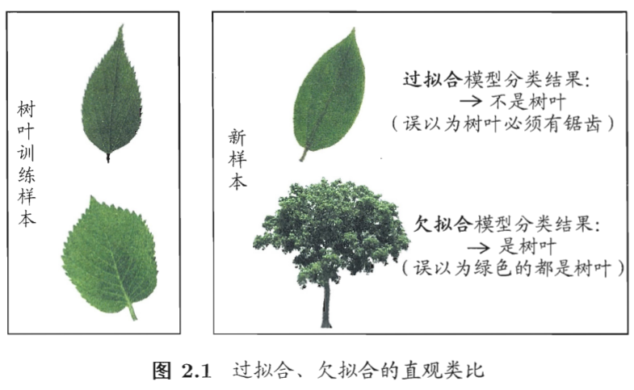

# 机器学习导论课程笔记

[toc]

## 基本术语
- 机器学习
通过计算的手段，利用经验来改善系统自身的性能
- 数据集
记录的集合，每组记录包含若干条属性的取值（称为示例/样本）
$D = \{(\boldsymbol{x}_i, y_i)\}$
- 样本空间
属性张成的空间，每个属性为一个坐标轴，每个样本称为特征向量
$\boldsymbol{x}_i = (x_{i_1}, x_{i_2}, \dots, x_{i_d})$
- 标记
每条记录$(\boldsymbol{x}_i, y_i)$附带一个关于样本结果的信息$y_i$
- 测试
利用学的模型$f$对测试样本$\boldsymbol{x}$预测，得到预测值$y = f(\boldsymbol{x})$，模型适用于新样本的能力即泛化能力
- 预测任务分类
    - 根据标记取值情况划分
        - 分类任务：标记为离散值（二分类、多分类等）
        - 回归任务：标记为连续值
        - 聚类任务：标记为空值，对示例进行自动分组
    - 根据标记完整情况划分
        - 监督学习：所有示例都有标记
        - 无监督学习：所有示例都没有标记
        - 半监督学习：少量示例有标记，大量示例没有
        - 噪音标记学习：标记有，但不完全准确
- 假设空间
    - 假设空间：所有假设（属性的可能组合）组成的空间
    - 版本空间：与训练集一致的假设的集合

- 归纳偏好
    - 定义：机器学习算法在学习过程中对某种类型假设的偏好
    - 奥卡姆剃刀原则：若有多个假设与观察一致，则选最简单（曲线最平滑）的那个
    - NFL定理（没有免费的午餐）：无论学习算法$\Sigma_a$多聪明，$\Sigma_b$多笨拙，他们的期望性能相同
    
    
    

## 模型评估
#### 经验误差与过拟合
- 错误率：$E = \frac{a}{m}$（$m$个样本$a$个分类错误）
- 精度：$1 - \frac{a}{m}$
- 误差：学习器的预测输出和真实输出的差异
- 经验误差：学习器在训练集上的误差
- 泛化误差：学习器在新样本上的误差
- 过拟合：训练样本学的太好，把训练集自身特点当做规律
    - 解决方法
        - 优化目标加正则项
        - early stopping
- 欠拟合：训练样本的一般性质尚未学好
    - 解决方法
        - 决策树：扩展分支
        - 神经网络：增加训练轮数

#### 评估方法
- 利用数据集$D = \{(\boldsymbol{x}_1, y_1), (\boldsymbol{x}_2, y_2), \dots, (\boldsymbol{x}_m, y_m)\}$划分出训练集$S$和测试集$T$
- 留出法
    - 直接划分$D = S \cup T$
    - $S,T$要保持数据分布的一致性（分层采样）
    - 一般若干次随机划分，重复试验取平均值
    - $|S|:|T|$一般为$2:1 \sim 4:1$
- 交叉验证法（$k$折交叉验证）
    - 将数据集分层采样为$k$个互斥子集
    - 每次用$k-1$个子集的并集训练，剩下的测试，最终返回$k$次测试结果的均值
    - $k = m$则为留一法
        - 不受划分方式影响
        - 结果准确
        - 计算开销大，一般不采用
- 自助法
    - 对$m$个样本的数据集$D$，有放回地取$m$次，取出作为训练集$D'$，$D-D'$作为测试集
    - 任一元素不被抽取的概率为$(1-\frac{1}{m})^m \rightarrow \frac{1}{e} \approx 0.368$
    - $|S|:|T| \approx 2:1$
    - 数据集小、难以有效划分时使用
- 调参
    - 参数过多时：将训练数据划分为训练集和验证集，使用验证集确定参数

#### 性能度量
- 评价模型泛化能力
- 均方误差
    - 回归任务最常用
    - $E(f;D) = \frac{1}{m} \sum_{i=1}^m(f(\boldsymbol{x_i})-y_i)^2$
- 错误率与精度
    - 分类任务常用
    - 错误率$E(f;D) = \frac{1}{m} \sum_{i=1}^m \mathbb{I}(f(\boldsymbol{x_i}) \neq y_i)$
    - 精度$acc(f;D) = \frac{1}{m} \sum_{i=1}^m \mathbb{I}(f(\boldsymbol{x_i}) = y_i) = 1-E(f;D)$
- 查准率、查全率与$F_1$

    - 根据学习器的预测结果按预测为正例的概率排序，设定判定为正例的概率阈值$P$，调整$P$，得到一组组$(P,R)$，绘制P-R曲线
    - $PRC$度量（什么样的$PRC$好）
        - 曲线下面积越大越好
        - 平衡点$BEP$：曲线上$(P=R)$的点
        - $F_1 = \frac{2PR}{P+R} = \frac{2TP}{m+TP-TN}$
        - $F_\beta = \frac{(1+\beta)^2 PR}{\beta^2 P+R}$
            - $\beta = 1$，$F_1$
            - $\beta > 1$，偏重$R$
            - $\beta < 1$，偏重$P$
        - 宏查准率、宏查全率与宏$F_1$，微查准率、微查全率与微$F_1$
        
        
- $ROC$与$AUC$
    - 真正例率$TPR = \frac{TP}{TP+FN}$，正例判对的比例
    - 假正例率$FPR = \frac{FP}{TN+FP}$，反例判错的比例
    - $ROC$度量
        - 测试样例中$m^+$个正例，$m^-$个反例，阈值由高到低变化
        - 开始位于$(0,0)$，每次阈值变化多出的正例若为真正例，$y = y + \frac{1}{m^+}$，若为假正例，$x = x + \frac{1}{m^-}$
        - $AUC$：曲线下面积
            - $AUC$越大越好
            - $AUC = \frac{1}{2} \sum_{i=1}^{m-1}(x_{i+1}-x_i)(y_i+y_{i+1})$
            - $AUC$衡量了样本预测的排序质量
            - $AUC = 1 - l_{rank}$
    
- 敏感代价错误率
    - 不同类型的错误造成的代价不同
    - 不再最小化错误次数，而是最小化总体代价
    

#### 比较检验
- 比较不同学习器的性能
- 二项检验
    - 泛化错误率$\epsilon$
    - 对$\epsilon < \epsilon_0$假设检验，则有$P(误分类率>\epsilon_0) < \alpha$，$\alpha$为显著度
    - $$\overline{\epsilon}=\max \epsilon \quad \mathrm{ s.t. }\sum_{\epsilon_0 m + 1}^{m} \tbinom{m}{i}\epsilon^i(1-\epsilon)^{m-i}<\alpha$$
- $t$检验
    - 重复留出法或$k$折交叉验证时，得到均值$\mu$与方差$\sigma^2$
    - $\mu = \frac{1}{k} \sum_{i=1}^k \epsilon_i$
    - $\sigma^2 = \frac{1}{k-1} \sum_{i=1}^k (\epsilon_i-\mu)^2$
    - 则服从$t$分布：$\frac{\sqrt{k}(\mu-\epsilon_0)}{\sigma} \sim t(k-1)$
    - 假设$\mu = \epsilon_0$，则$\frac{\sqrt{k}|\mu-\epsilon_0|}{\sigma} \in [t_{-\frac{\alpha}{2}}, t_{\frac{\alpha}{2}}]$
- 交叉验证$t$检验
    - 对学习器A、B使用$k$折交叉验证得到错误率$\epsilon_1^A,\epsilon_2^A,\dots\epsilon_k^A,\epsilon_1^B,\epsilon_2^B,\dots\epsilon_k^B$
    - 定义$\Delta_i = \epsilon_i^A-\epsilon_i^B$进行成对$t$检验，$\frac{\sqrt{k}\mu}{\sigma} \sim t(k-1)$
    - 若$|\frac{\sqrt{k}\mu}{\sigma}| < t_{\frac{\alpha}{2}}(k-1)$，则接受原假设，即两个学习器无显著差别

#### 偏差与方差
- 评价模型的理论基础
- 测试样本$\boldsymbol{x}$，其在数据集中的标记为$y_D$，真实标记为$y$（对于噪声$y_D \neq y$），$f(\boldsymbol{x}; D)$为学得模型在$\boldsymbol{x}$上的输出
- 期望预测为
- 偏差-方差窘境
    - 训练不足时，拟合能力弱，训练数据扰动影响不大，偏差主导泛化误差
    - 训练加深，拟合能力弱，方差主导
    - 训练充足，拟合能力非常强，轻微的数据扰动可导致显著变化，训练数据自身特性被学习到则发生过拟合

## 线性模型
#### 基本形式
- 用$d-1$维的超平面划分$d$维空间
- 线性模型学得一个通过属性的线性组合进行预测的函数
$$f(\boldsymbol{x})=w_1x_1+w_2x_2+\dots+w_dx_d+b=\boldsymbol{w}^{\mathrm{T}}\boldsymbol{x}+b$$
- 可解释性很好

#### 线性回归
- 离散属性处理
    - 有序关系：转化为连续值
    - 无序关系：若有$k$个离散属性，转化为$k$维向量，使用独热编码(one-hot)
- 最小二乘法

#### 二分类任务

#### 多分类任务

#### 类别不平衡问题

## 决策树
TODO

## 神经网络
TODO

## 支持向量机
TODO

## 贝叶斯分类器
TODO

## 集成学习
TODO

## 聚类
TODO

## 降维与度量学习
TODO